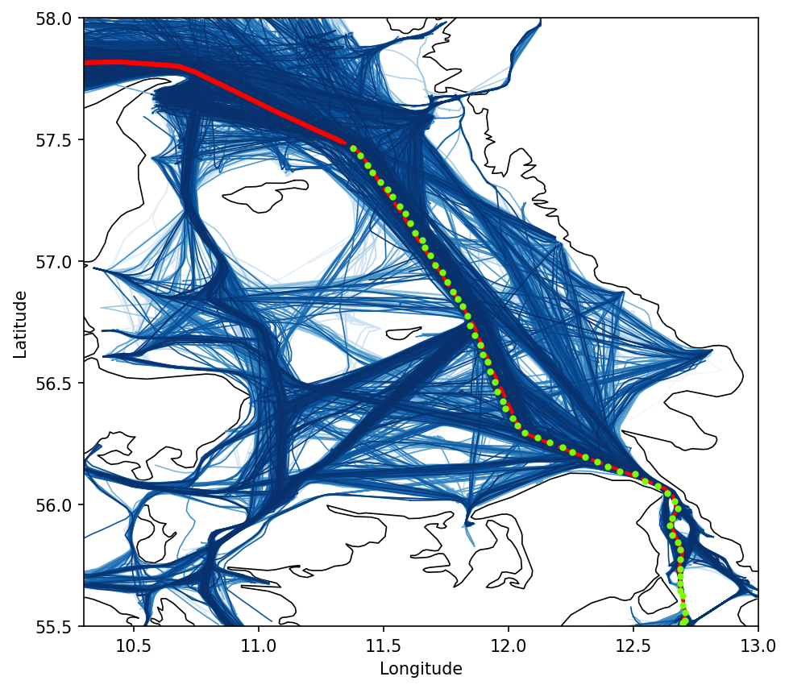

# TrAISformer

Pytorch implementation of TrAISformer---A generative transformer for AIS trajectory prediction (https://arxiv.org/abs/2109.03958).

The transformer part is adapted from: https://github.com/karpathy/minGPT

---

  

#### Requirements: 
See requirements.yml

### Datasets:

The data used in this paper is provided by the [Danish Maritime Authority (DMA)](https://www.dma.dk/SikkerhedTilSoes/Sejladsinformation/AIS/Sider/default.aspx). 
Please refer to [the paper](https://arxiv.org/abs/2109.03958) for the details of the pre-processing step. 

A processed data can be found in `./data/ct_dma/`

### Run

Run `trAISformer.py` to train and evaluate the model.

### License

See `LICENSE`

### Contact
For any questions, please open an issue and assign it to @dnguyengithub.

